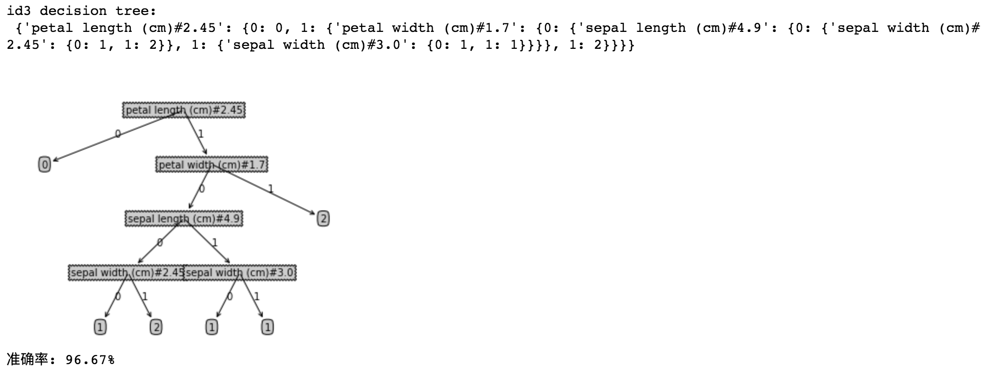
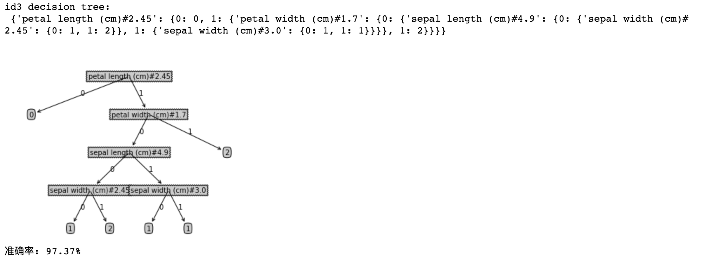

##	决策树分类器的构建及应用

*	实验目标

	理解决策树分类器的原理

	能用 python 构造一个决策树

	准确评估分类器精度

*	实验工具

	Python

	<br>

##	实验原理

*	基本原理

	*	经验熵, HD, empirical entrophy

		```
		H(D) = - Σ [ pi · lg(pi) ]
		pi = Ci / D
		```

	*	经验条件熵, HD_A, empirical conditional entrophy

		```
		H(D|A) = Σ [ (Di/D) * H(Di) ]
		```

	*	连续属性的经验条件熵 ( 参考[机器学习导论, Miroslav Kubat](https://book.douban.com/subject/26936258/) )

		基本思想是将连续属性分为 0 - 1 离散属性, 计算不同分割点得到的信息增益, 取最大的信息增益, 及相应的分割点 threshold

		首先对某一属性 A 按属性值 x 从小到大排序, 得到新的数据集 new_dataset

		对于 new_dataset, 寻找每一处类别(y)变化的地方, 如 y[i-1] = -1, y[i] = 1, 记 threshold[j] = ( x[i-1] + x[i] ) / 2

		然后以 threshold 为界, 将数据集分为 x <= threshold 的部分, 即 dataset[:i], 以及 x > threshold 的部分, 即 dataset[i:]

		计算 p1 = i / len(dataset), p2 = 1 - p1

		分别计算 HD1 = get_HD(new_dataset[:i]), HD2 = get_HD(new_dataset[i:])

		计算 H(D|A) = p1 * HD1 + p2 * HD2

		计算 info_gain = H(D) - H(D|A), 选择最大的 info_gain 及相应的分割点 threshold

	*	信息增益, information gain

		```
		g(D, A) = H(D) - H(D|A)
		```

	*	信息增益比, information gain ratio

		```
		info_gain_ratio = info_gain / IV(A)
		pi = Ai / D
		IV(A) = Σ [ pi · lg(pi) ]
		```

	*	ID3 采用 info_gain 作为划分依据, C4.5 采用 info_gain_ratio 作为划分依据

*	参考资料

	*	[统计学习方法, 李航著](https://book.douban.com/subject/10590856/)

	*	[机器学习, 周志华著](https://book.douban.com/subject/26708119/)

	*	[机器学习导论, Miroslav Kubat](https://book.douban.com/subject/26936258/)

	*	[MLA, Machine Learning in Action, 机器学习实战, Peter Harrington著](https://book.douban.com/subject/24703171/)

	<br>

##	生成数据集

*	我们对 sklearn 自带的 iris 数据集进行乱序排列, 并按比例生成训练集和测试集, 且每一条记录的格式如下

	```
	[5.8, 4.0, 1.2, 0.2, 0]
	```

	record 一共有 5 列, 前 4 列的数值分别对应 x 的四个属性值. 最后一列的数值是整型, 对应 y, 即类别.

	完整代码请参阅 gen_iris_dataset.py

	<br>

##	ID3 算法的实现

*	完整代码请参阅 dt_id3.py

	train_ratio=0.8, seed=2 的情况下, 运行结果如图所示

	

	<br>

##	C4.5 算法的实现

*	完整代码请参阅 dt_c45.py

	train_ratio=0.8, seed=2 的情况下, 运行结果如图所示

	

	<br>

##	附录

*	[原实验文档](http://ssea.ustcsz.edu.cn:443/UploadFiles/experimentResources/20181226/%E5%AE%9E%E9%AA%8C%E4%B8%89%20%20%E5%86%B3%E7%AD%96%E6%A0%91%E5%88%86%E7%B1%BB%E5%99%A8%E7%9A%84%E6%9E%84%E5%BB%BA%E5%8F%8A%E5%BA%94%E7%94%A8%E5%AE%9E%E9%AA%8C_20181226173020518.pdf)
