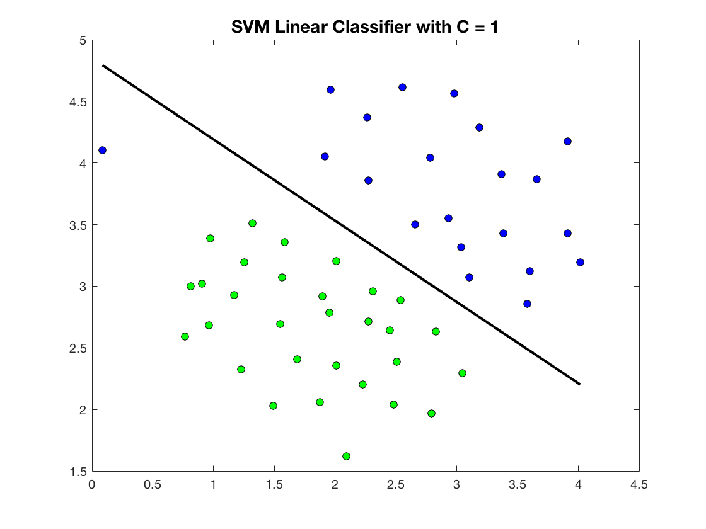
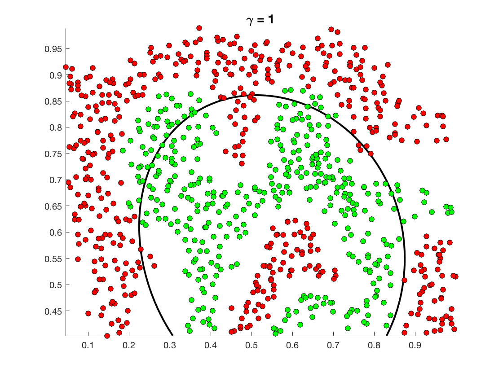
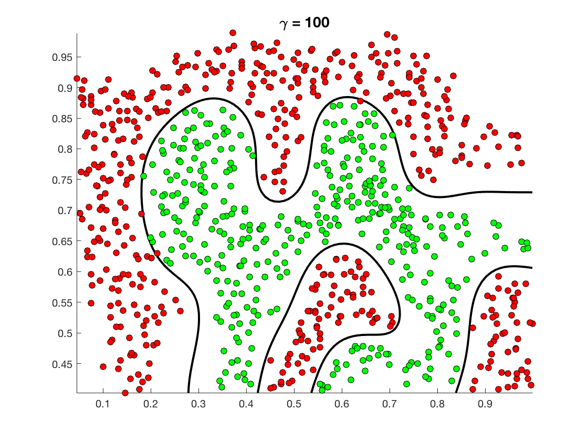

##	使用 SVM 进行分类

*	实验目标

	理解 SVM 的分类原理

	能根据数据集设计合理的 SVM 分类方法

	准确评估分类器精度

*	实验工具

	[libsvm](https://github.com/cjlin1/libsvm)

	[matlab](https://www.mathworks.com/downloads/)

	<br>

##	实验原理

*	参考文档

	*	[SVM 算法原理](https://blog.csdn.net/u012581541/article/details/51181041)

	*	[机器学习算法与python实践之（二）支持向量机（SVM）初级](https://blog.csdn.net/zouxy09/article/details/17291543)

	*	[SVM入门（一）至（三）Refresh](http://www.blogjava.net/zhenandaci/archive/2009/02/13/254519.html)

	*	[支持向量机: Kernel](http://blog.pluskid.org/?p=685)

	*	[机器学习, 周志华著](https://book.douban.com/subject/26708119/)

	*	[统计学习方法, 李航著](https://book.douban.com/subject/10590856/)

	*	[MLA, Machine Learning in Action, 机器学习实战, Peter Harrington著](https://book.douban.com/subject/24703171/)

	<br>

##	实验准备

*	实验环境

	Ubuntu 16.04 x64

	matlab R2016b, academic use

	libsvm v323

*	安装 libsvm

	```bash
	$ sudo apt-get update
	$ sudo apt-get install g++ make p7zip-full
	$ mkdir libsvm
	$ cd libsvm
	$ wget https://codeload.github.com/cjlin1/libsvm/zip/v323
	$ 7z x v323.zip
	```

	接着打开 matlab, 然后通过 command window 切换到 `libsvm-323/matlab` 目录, 然后执行 make 即可

	```matlab
	>> make
	```

	参考文档 [Matlab interface of LIBSVM](https://github.com/cjlin1/libsvm/tree/master/matlab)

*	调用和测试 libsvm

	matlab 调用 libsvm 的大致形式如下, 具体代码稍后在下面的实例中介绍

	```matlab
	[y, x] = libsvmread(train_set);
	model = svmtrain(train_y, train_x, sprintf('-s 0 -t 0'));
	[test_y, test_x] = libsvmread(test_set);
	[pred_y, accu, decision_values] = svmpredict(test_y, test_x, model);
	```

	<br>

##	实验步骤

*	实验文档摘抄自这篇博客

	[[机器学习实验6]线性SVM分类和非线性SVM分类](https://blog.csdn.net/gyh_420/article/details/77943973)

	而这篇博客的内容来自 Stanford 的公开课 Machine Learning (by Andrew Ng)

	更具体地, 博客内容来自

	*	作业7, [Exercise 7: SVM Linear Classification](http://openclassroom.stanford.edu/MainFolder/DocumentPage.php?course=MachineLearning&doc=exercises/ex7/ex7.html)

	*	作业8, [Exercise 8: Non-linear SVM classification with kernels](http://openclassroom.stanford.edu/MainFolder/DocumentPage.php?course=MachineLearning&doc=exercises/ex8/ex8.html)

	按照以上关键字进行搜索, 可以找到丰富的资源。另外, 为了尊重原作者, 建议在实验说明文档中标注出处/原文链接。

	接下来分别对两个实验进行介绍。

	<br>

##	实验 1, SVM Linear Classification

*	注意, 由于本次实验使用 matlab 实现, 因此以下均假设 command window 已经切换到了 `libsvm/libsvm-323/matlab` 目录, 而且所有数据集都下载到了 `libsvm/libsvm-323/matlab/dataset` 目录下

*	首先下载并解压 [ex7Data数据集](http://openclassroom.stanford.edu/MainFolder/courses/MachineLearning/exercises/ex7materials/ex7Data.zip)

*	我们对其中的 `twofeature.txt` 文件进行分类

	```matlab
	% 读取训练集数据
	[y, x] = libsvmread('dataset/ex7Data/twofeature.txt');

	% Setting the cost, 设置参数 C
	% 调节 C 可以调节分类面的 Margin
	% C越大, Margin 越小, 正确率也越高, 但在非线性的分类问题中可能会出现过拟合
	C = 1;
	% C = 10;
	% C = 100;

	% 训练模型, sprintf() 输入的是 option 参数
	model = svmtrain(y, x, sprintf('-s 0 -t 0 -c %g', C));
	w = model.SVs' * model.sv_coef;
	b = -model.rho;

	if (model.Label(1) == -1)
	    w = -w; b = -b;
	end

	% Ploting the data points, 画出数据点图
	figure
	pos = find(y == 1);
	neg = find(y == -1);
	plot(x(pos,1), x(pos,2), 'ko', 'MarkerFaceColor', 'b'); hold on;
	plot(x(neg,1), x(neg,2), 'ko', 'MarkerFaceColor', 'g')

	% Plotting the decision boundary, 画出分类超平面
	plot_x = linspace(min(x(:,1)), max(x(:,1)), 30);
	plot_y = (-1/w(2))*(w(1)*plot_x + b);
	plot(plot_x, plot_y, 'k-', 'LineWidth', 2)

	% 标题
	title(sprintf('SVM Linear Classifier with C = %g', C), 'FontSize', 14)
	```

	可以看到 C = 1 的图示结果如下, 调节 C, 结果会有差别

	

*	接着, 我们处理 `email` 数据集, 使用线性 SVM 判断每一条记录是否为垃圾邮件

	```matlab
	% SVM Email text classification
	% 加载训练数据
	[train_y, train_x] = libsvmread('dataset/ex7Data/email_train-100.txt');

	% Train the model and get the primal variables w, b from the model
	model = svmtrain(train_y, train_x, '-s 0 -t 0');

	w = model.SVs' * model.sv_coef;
	b = -model.rho;
	if (model.Label(1) == -1)
	    w = -w; b = -b;
	end

	% 加载测试数据
	[test_y, test_x] = libsvmread('dataset/ex7Data/email_test.txt');

	% 分类预测
	[predicted_label, accuracy, decision_values] = svmpredict(test_y, test_x, model);

	% Ploting the data points
	figure
	pos = find(test_y == 1);
	neg = find(test_y == -1);
	plot(test_x(pos,1), test_x(pos,2), 'ko', 'MarkerFaceColor', 'b'); hold on;
	plot(test_x(neg,1), test_x(neg,2), 'ko', 'MarkerFaceColor', 'g')

	% Plotting the decision boundary
	plot_x = linspace(min(test_x(:,1)), max(test_x(:,1)), 30);
	plot_y = (-1/w(2))*(w(1)*plot_x + b);
	plot(plot_x, plot_y, 'k-', 'LineWidth', 2)
	```

	可以看到使用 `email_train-100.txt` 数据集进行训练后, 测试的准确率为 `88.4615%`, 图示结果如下。尝试使用不同的训练集, 测试结果会有差别。

	

*	实验 1 的过程和代码参考了

	[Exercise 7: SVM Linear Classification](http://openclassroom.stanford.edu/MainFolder/DocumentPage.php?course=MachineLearning&doc=exercises/ex7/ex7.html)

	[TwoFeature_SVMClassification by DishantK1807](https://github.com/DishantK1807/Machine-Learning-Algorithms-Andrew-Ng./blob/master/SVM-Linear-Classification/TwoFeature_SVMClassification.m)

	[two features SVM by 2011aad](https://github.com/2011aad/Machine-Learning-Assignments--Coursera-Andrew-Ng--/blob/3c2eeea25622206246b100096498a654bdeb6edf/Machine-Learning-ex7/SVM.m)

	[EmailText_SVMClassification by DishantK1807](https://github.com/DishantK1807/Machine-Learning-Algorithms-Andrew-Ng./blob/master/SVM-Linear-Classification/EmailText_SVMClassification.m)

	<br>

##	实验 2, Non-linear SVM classification with kernels

*	首先下载并解压 [ex8Data数据集](http://openclassroom.stanford.edu/MainFolder/courses/MachineLearning/exercises/ex8materials/ex8Data.zip)

*	接着我们分别处理 `ex8a` 和 `ex8b` 数据集, 这是两个非线性可分的数据集, 我们将使用 Radial Basis Function (RBF) kernel 进行特征映射, 这个 kernel 与 高斯核有一些差别, 详见 [ex8 的课件](http://openclassroom.stanford.edu/MainFolder/DocumentPage.php?course=MachineLearning&doc=exercises/ex8/ex8.html)

	RBF 的重要参数是 γ(gamma), 调节这个参数可以改变分类效果

	```matlab
	clear all; close all; clc;
	% 加载数据集
	[y, x] = libsvmread('dataset/ex8Data/ex8a.txt');

	% Libsvm options 参数
	% -s 0 : classification
	% -t 2 : RBF kernel
	% -g : gamma in the RBF kernel

	% gamma 越大, 在训练集上的拟合效果越好, 但是容易出现过拟合
	% gamma = 1
	% gamma = 10
	gamma = 100;
	model = svmtrain(y, x, sprintf('-s 0 -t 2 -g %g', gamma));

	[pred_y, accu, decision_values] = svmpredict(y, x, model);

	% Plot training data and decision boundary
	% plotboundary() 可以在下载到的数据集压缩包中找到
	plotboundary(y, x, model);
	% plotboundary(y, x, model, 't');

	title(sprintf('\\gamma = %g', gamma), 'FontSize', 14);
	```

	可以看到在数据集 `ex8a.txt` 上, gamma=1 和 gamma = 100 的分类图示结果如下。调节不同的 gamma 值, 测试结果会有差别。

	

	

*	实验 2 的过程和代码参考了

	[Exercise 8: Non-linear SVM classification with kernels](http://openclassroom.stanford.edu/MainFolder/DocumentPage.php?course=MachineLearning&doc=exercises/ex8/ex8.html)

	[Nonlinear_Classification by 2011aad](https://github.com/2011aad/Machine-Learning-Assignments--Coursera-Andrew-Ng--/blob/3c2eeea25622206246b100096498a654bdeb6edf/Machine-Learning-ex8/Nonlinear_Classification.m)

	[[机器学习实验6]线性SVM分类和非线性SVM分类](https://blog.csdn.net/gyh_420/article/details/77943973)

	<br>

##	附加实验

*	使用 libsvm 对 iris 数据集进行分类

	下载数据集 [iris.scale](https://www.csie.ntu.edu.tw/~cjlin/libsvmtools/datasets/multiclass/iris.scale), 并保存为 `iris.txt`

*	使用 python 生成训练集与测试集

	```python
	def get_index_list(shuffle=True, seed=None):
		import numpy as np
		index_list = np.arange(150)
		if shuffle:
			if seed:
				np.random.seed(seed)
			np.random.shuffle(index_list)
		return index_list

	def get_train_and_test_data(train_ratio=0.8, shuffle=True, seed=1):
		size = 150
		train_size = int(size * train_ratio)
		test_size = size - train_size

		index_list = get_index_list(shuffle=shuffle, seed=seed)
		train_index = index_list[:train_size]
		test_index = index_list[train_size:]

		with open('iris.txt') as f:
			dataset = f.read().split('\n')

		# train_set
		with open('iris_train.txt', 'w') as f:
			for i in train_index:
				f.write(dataset[i] + '\n')

		# test_set
		with open('iris_test.txt', 'w') as f:
			for i in test_index:
				f.write(dataset[i] + '\n')

	if __name__ == '__main__':
		get_train_and_test_data(train_ratio=0.7, shuffle=True, seed=2)
	```

*	在 matlab 中使用 libsvm 进行训练与测试

	```matlab
	[y, x] = libsvmread('dataset/iris_train.txt');
	model = svmtrain(y, x, sprintf('-s 0 -t 2 -c 1 -g 0.1'));
	w = model.SVs' * model.sv_coef;
	b = -model.rho;

	if model.Label(1) == -1
	  w = -w;
	  b = -b;
	end

	[test_y, test_x] = libsvmread('dataset/iris_test.txt');
	[pred_y, accu, decision_values] = svmpredict(test_y, test_x, model);
	```

	对于 seed=2 生成的数据集, 测试不同的参数组合, 可以看到当 option 参数为 `-s 0 -t 2 -c 1 -g 0.1` 时准确率较高, 达到了 97.7778%

	<br>

##	附录

*	最后, 附上 svm-train 的 options, 内容来自[libsvm 文档](https://github.com/cjlin1/libsvm/tree/master)

	```
	-s svm_type : set type of SVM (default 0)
		0 -- C-SVC		(multi-class classification)
		1 -- nu-SVC		(multi-class classification)
		2 -- one-class SVM
		3 -- epsilon-SVR	(regression)
		4 -- nu-SVR		(regression)
	-t kernel_type : set type of kernel function (default 2)
		0 -- linear: u'*v
		1 -- polynomial: (gamma*u'*v + coef0)^degree
		2 -- radial basis function: exp(-gamma*|u-v|^2)
		3 -- sigmoid: tanh(gamma*u'*v + coef0)
		4 -- precomputed kernel (kernel values in training_set_file)
	-d degree : set degree in kernel function (default 3)
	-g gamma : set gamma in kernel function (default 1/num_features)
	-r coef0 : set coef0 in kernel function (default 0)
	-c cost : set the parameter C of C-SVC, epsilon-SVR, and nu-SVR (default 1)
	-n nu : set the parameter nu of nu-SVC, one-class SVM, and nu-SVR (default 0.5)
	-p epsilon : set the epsilon in loss function of epsilon-SVR (default 0.1)
	-m cachesize : set cache memory size in MB (default 100)
	-e epsilon : set tolerance of termination criterion (default 0.001)
	-h shrinking : whether to use the shrinking heuristics, 0 or 1 (default 1)
	-b probability_estimates : whether to train a SVC or SVR model for probability estimates, 0 or 1 (default 0)
	-wi weight : set the parameter C of class i to weight*C, for C-SVC (default 1)
	-v n: n-fold cross validation mode
	-q : quiet mode (no outputs)


	The k in the -g option means the number of attributes in the input data.

	option -v randomly splits the data into n parts and calculates cross
	validation accuracy/mean squared error on them.
	```

*	[原实验文档](http://ssea.ustcsz.edu.cn:443/UploadFiles/experimentResources/20181226/%E5%AE%9E%E9%AA%8C%E5%9B%9B%20%20%E5%88%A9%E7%94%A8SVM%E5%AE%9E%E7%8E%B0%E5%88%86%E7%B1%BB%E5%AE%9E%E9%AA%8C_20181226173311956.pdf)
